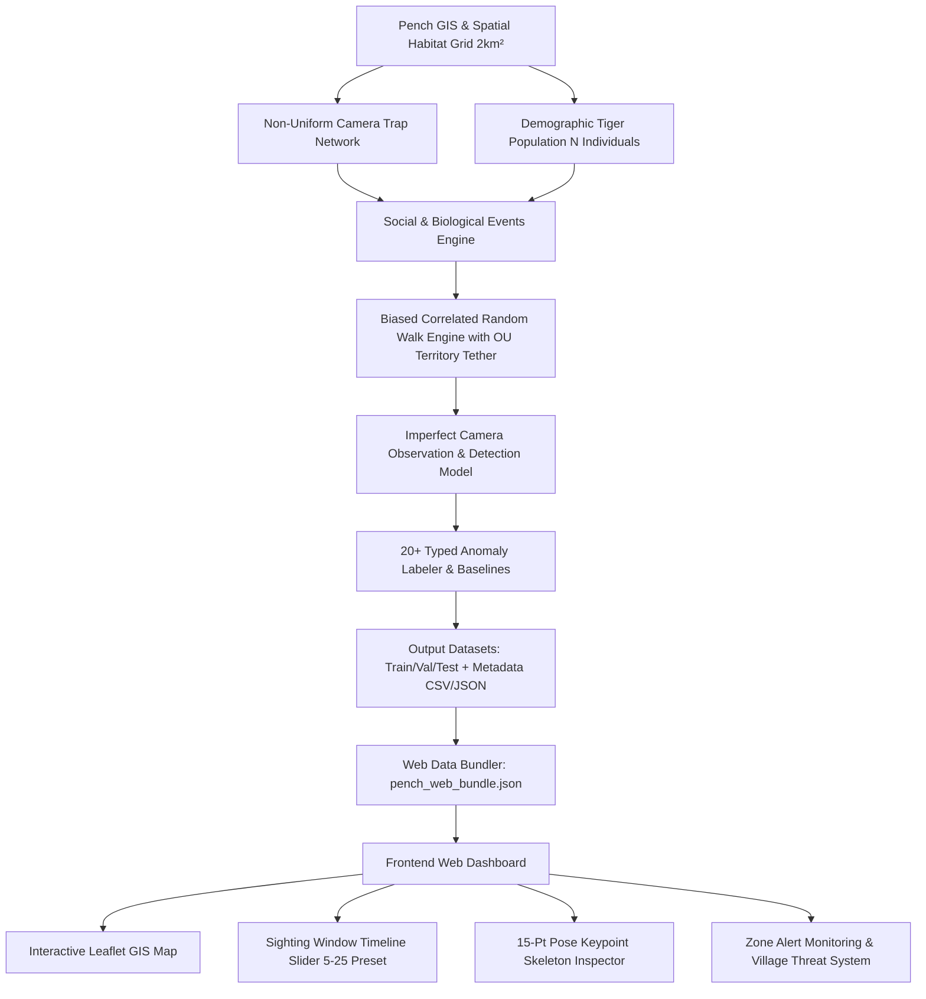

# Pench Tiger Reserve — Synthetic Data Seeding & Monitoring Dashboard
## Comprehensive Implementation Plan & Engineering Blueprint

This document provides the complete, production-ready engineering plan to generate, seed, and visualize realistic synthetic tiger movement and camera-trap monitoring data for **Pench Tiger Reserve (Maharashtra / Madhya Pradesh)**.

It incorporates all ecological constraints, movement confinement fixes (Ornstein-Uhlenbeck territory tethering), non-boxish Voronoi sub-regions, 20+ typed anomaly scenarios, and the frontend **Sighting Window Timeline Slider** architecture.

---

## 1. System Architecture Overview



---

## 2. GIS & Environmental Layer Specifications

### 2.1 Geographic Coordinates & Reserve Boundary
- **Bounding Box**: Lat $21.490^\circ\text{N} \to 21.785^\circ\text{N}$, Lon $79.095^\circ\text{E} \to 79.410^\circ\text{E}$.
- **Core Forest Area**: $439\text{ km}^2$ polygon (solid green, `#22c55e`).
- **Buffer Zone Area**: $301\text{ km}^2$ perimeter polygon (dashed amber, `#eab308`).
- **44 Surrounding Villages**: Placed around buffer perimeter with population figures for human-wildlife conflict tracking.
- **Hydrological Network**: 14 mapped water sources (Pench River main stem, Totladoh Reservoir, Jamni River, seasonal nalas, and waterholes).

### 2.2 Range Allocation Matrix (Carrying Capacity)
Tigers are distributed across real forest ranges to prevent unnatural spatial clustering:

| Range Name | Zone Type | Target Tiger Share | Default Area | Prefix |
|---|---|---|---|---|
| **East Pench** | Core Forest | 15% | Lat 21.600–21.700, Lon 79.290–79.360 | `PTR-CORE-EP` |
| **West Pench** | Core Forest | 13% | Lat 21.660–21.730, Lon 79.140–79.210 | `PTR-CORE-WP` |
| **Chorbahuli** | Core Forest | 13% | Lat 21.610–21.680, Lon 79.220–79.280 | `PTR-CORE-CHB` |
| **Devalapar** | Core Forest | 11% | Lat 21.685–21.740, Lon 79.215–79.275 | `PTR-CORE-DEV` |
| **Saleghat** | Core Forest | 11% | Lat 21.560–21.630, Lon 79.145–79.205 | `PTR-CORE-SAL` |
| **Paoni Buffer** | Buffer Zone | 8% | Lat 21.510–21.565, Lon 79.175–79.255 | `PTR-BUF-PAO` |
| **Nagalwadi Buffer** | Buffer Zone | 8% | Lat 21.505–21.560, Lon 79.250–79.330 | `PTR-BUF-NAG` |
| **Sillari Buffer** | Buffer Zone | 8% | Lat 21.580–21.690, Lon 79.360–79.395 | `PTR-BUF-SIL` |
| **West Buffer** | Buffer Zone | 5% | Lat 21.560–21.650, Lon 79.105–79.145 | `PTR-BUF-W` |
| **North Buffer** | Buffer Zone | 5% | Lat 21.735–21.765, Lon 79.155–79.290 | `PTR-BUF-N` |
| **NH-44 Corridor** | Wildlife Corridor | 3% | Lat 21.540–21.720, Lon 79.258–79.272 | `PTR-COR-NH44` |

---

## 3. Backend Synthetic Data Generation Engine (`generate_pench_metadata.py`)

### 3.1 Population Demographics & Territory Allocation
For any target population size $N$:
1. **Sex Ratio**: $\sim 55\%$ Female, $45\%$ Male.
2. **Age Pyramids**: Cubs ($<1$ yr, $8\%$), Subadults ($1\text{--}3$ yrs, $30\%$), Young Adults ($3\text{--}5$ yrs, $15\%$), Adults ($5\text{--}10$ yrs, $40\%$), Older Adults ($>10$ yrs, $7\%$).
3. **Realistic Home Range Sizes**:
   - **Adult Resident Females**: $16\text{--}26\text{ km}^2$ ($r = 2.25\text{--}2.88\text{ km}$)
   - **Adult Resident Males**: $32\text{--}55\text{ km}^2$ ($r = 3.19\text{--}4.18\text{ km}$)
   - **Subadults / Cubs**: $6\text{--}16\text{ km}^2$ ($r = 1.38\text{--}2.25\text{ km}$)
   - **Transients / Dispersing**: $40\text{--}75\text{ km}^2$ ($r = 3.56\text{--}4.88\text{ km}$)
4. **Spatial Jitter**: Centroids are placed inside candidate habitat cells belonging to the tiger's assigned range with Gaussian noise ($\sigma \approx 0.008^\circ \approx 0.8\text{ km}$) to prevent duplicate coordinates.

### 3.2 Movement Engine: Ornstein-Uhlenbeck Territory Tethering
To ensure tigers patrol their own range instead of wandering across the entire reserve:

```python
def movement_weight(lat, lon, season, tiger_centroid, tiger_radius,
                    familiarity, cur_lat, cur_lon, tiger_movement_state="NORMAL",
                    prev_bear_deg=None, cur_bear_deg=None):
    key, cell = nearest_cell(lat, lon)
    suit    = cell["suitability"]
    prey    = cell["seasonal_prey_" + season]
    water   = cell["seasonal_water_" + season]
    disturb = cell["human_disturbance"]

    # Ecological suitability
    w_eco = suit * 0.35 + prey * 0.35 + water * 0.20 - disturb * 0.30
    w_eco = max(0.05, w_eco)

    # Distances from territory centroid
    d_cand = dist_km(lat, lon, tiger_centroid[0], tiger_centroid[1])
    d_cur  = dist_km(cur_lat, cur_lon, tiger_centroid[0], tiger_centroid[1])
    step_len = max(0.1, dist_km(lat, lon, cur_lat, cur_lon))

    # Tether strength by state
    if tiger_movement_state == "DISPERSAL":
        eff_radius = tiger_radius * 2.5
        tether_strength = 0.6
    elif tiger_movement_state in ("EXPLORATORY", "LONG_DISTANCE"):
        eff_radius = tiger_radius * 1.35
        tether_strength = 2.0
    else:
        eff_radius = tiger_radius
        tether_strength = 4.5

    # Boundary potential (exponential decay beyond 0.70 R)
    boundary_excess = max(0.0, d_cand - 0.70 * eff_radius)
    f_boundary = math.exp(-tether_strength * (boundary_excess / max(0.4, 0.35 * eff_radius)) ** 2)

    # Directional centering bias
    if d_cand > d_cur:
        f_dir = math.exp(-3.5 * ((d_cand - d_cur) / step_len) * max(0.2, d_cand / eff_radius))
    else:
        f_dir = 1.0 + 2.5 * ((d_cur - d_cand) / step_len) * max(0.2, d_cur / eff_radius)

    # Directional persistence
    dir_factor = 1.0
    if prev_bear_deg is not None and cur_bear_deg is not None:
        turn = abs(cur_bear_deg - prev_bear_deg) % 360
        if turn > 180:
            turn = 360 - turn
        dir_factor = 0.75 + 0.25 * math.cos(math.radians(turn))

    fam = min(1.0, familiarity.get(key, 0) / 6.0) * 0.15
    w = w_eco * f_boundary * f_dir * (1.0 + fam) * dir_factor
    return max(0.0001, w)
```

### 3.3 Calibrated 3-Hour Step Lengths
- `RESTING`: $0.05\text{--}0.20\text{ km}$
- `SLOW`: $0.20\text{--}0.60\text{ km}$
- `NORMAL`: $0.50\text{--}1.50\text{ km}$ (average daily patrol: $4\text{--}8\text{ km}$)
- `EXPLORATORY`: $1.20\text{--}2.60\text{ km}$
- `LONG_DISTANCE`: $2.50\text{--}4.50\text{ km}$
- `DISPERSAL`: $3.50\text{--}7.00\text{ km}$

### 3.4 Camera Observation & Detection Model
- **Effective Camera Range**: $600\text{ m}$ ($0.6\text{ km}$).
- **Detection Probability**:
  $$P(\text{det}) = e^{-3.5 d} \cdot \text{vis}(\text{habitat}) \cdot \text{season\_mod} \cdot \text{activity}(h) \cdot \text{tiger.detectability} + \text{trail\_bonus}$$
- **Camera Failures**: Pre-scheduled Poisson failure windows (battery depletion, memory full, IR filter failure, maintenance outage).
- **Image Quality & Confidence**:
  - `excellent` ($0.92$), `good` ($0.82$), `good_ir` ($0.74$), `partial` ($0.55$), `occluded` ($0.35$), `poor` ($0.28$).

### 3.5 Anomaly Labeling & Individualized Baselines
- Baselines are established from each tiger's first 6 months ($180$ days).
- **20+ Labeled Anomaly Categories**:
  - `normal`, `water_driven_movement`, `prey_driven_movement`, `prolonged_absence`
  - `range_expansion`, `range_contraction`, `territory_shift`, `new_region_entry`
  - `first_buffer_entry`, `increasing_buffer_use`, `village_approach`, `repeated_village_proximity`
  - `forest_exit`, `territorial_conflict`, `post_injury_movement`, `dispersal`
  - Hard negatives: `hn_missed_detection_camera_failure`, `hn_buffer_visit_single`, `hn_seasonal_change_normal`.

---

## 4. Web Data Bundling (`prepare_web_data.py`)

Outputs a unified `pench_web_bundle.json` containing:
1. `metadata`: Reserve statistics, thresholds, simulation parameters.
2. `zone_boundaries`: Core forest and buffer zone polygons.
3. `sub_regions`: 11 Voronoi-tessellated polygon boundaries with centroids and theme colors.
4. `villages`: 44 buffer village markers with population data.
5. `water_sources`: Rivers, reservoirs, and seasonal waterhole coordinates.
6. `stations`: 311 camera stations with trap-night effort and failure counts.
7. `territories`: Per-tiger records with sighting-aligned centroids and home-range radii.
8. `last_seen`: Quick lookup of latest sighting and alert status per tiger.
9. `alert_summary`: Aggregated counts (`SAFE`, `CAUTION`, `CRITICAL`).
10. `sightings`: Full array of chronologically sorted sighting events.

---

## 5. Frontend Architecture & Sighting Window Timeline Slider

### 5.1 HTML Components (`index.html`)

```html
<!-- Sighting Window Timeline Widget (Bottom Right) -->
<div class="timeline-widget hidden" id="timeline-widget">
  <div class="timeline-header">
    <div class="timeline-title">
      <i class="fa-solid fa-timeline"></i>
      <span>SIGHTING WINDOW</span>
    </div>
    <div class="timeline-stats">
      <span class="timeline-window-label" id="timeline-window-label">Last 15 sightings</span>
      <span class="timeline-count-badge" id="timeline-count-badge">15 / 15</span>
    </div>
  </div>

  <div class="timeline-body">
    <div class="timeline-date-labels">
      <span class="timeline-date-from" id="timeline-date-from">—</span>
      <span class="timeline-date-to" id="timeline-date-to">—</span>
    </div>

    <div class="timeline-slider-track">
      <div class="timeline-range-wrapper">
        <input type="range" id="timeline-start" class="timeline-range tl-start" min="0" max="100" value="0" step="1">
        <input type="range" id="timeline-end"   class="timeline-range tl-end"   min="0" max="100" value="100" step="1">
        <div class="timeline-fill" id="timeline-fill"></div>
      </div>
    </div>

    <div class="timeline-controls">
      <button class="btn-tl-preset" data-n="5">5</button>
      <button class="btn-tl-preset" data-n="10">10</button>
      <button class="btn-tl-preset active" data-n="15">15</button>
      <button class="btn-tl-preset" data-n="25">25</button>
      <button class="btn-tl-preset btn-tl-all" data-n="all">All</button>
      <div class="tl-territory-toggle">
        <label class="tl-checkbox-label">
          <input type="checkbox" id="tl-show-territory" checked>
          <span><i class="fa-solid fa-circle-dot"></i> Territory</span>
        </label>
      </div>
    </div>
  </div>
</div>
```

### 5.2 Dynamic Territory Calculation in `app.js`

To ensure the territory circle **always matches the visible sighting duration** and reflects standard $15\text{--}20\text{ km}^2$ dimensions:

```javascript
function renderFilteredTrail() {
  const tigerId = state.selectedTigerId;
  if (!tigerId) return;

  const allSightings = state.tigerSightingsMap[tigerId] || [];
  const total = allSightings.length;
  if (total === 0) return;

  const tInfo = state.data.territories[tigerId];
  const startIdx = Math.max(0, Math.min(state.timeline.startIdx, total - 1));
  const endIdx   = Math.max(startIdx, Math.min(state.timeline.endIdx, total - 1));
  const slice    = allSightings.slice(startIdx, endIdx + 1);

  state.layers.singleTigerTrail.clearLayers();
  state.layers.singleTigerTerritory.clearLayers();

  // Dynamic Territory Circle based on visible sightings
  if (state.timeline.showTerritory && slice.length > 0) {
    const avgLat = slice.reduce((sum, s) => sum + s.latitude, 0) / slice.length;
    const avgLon = slice.reduce((sum, s) => sum + s.longitude, 0) / slice.length;

    const maxDistKm = Math.max(...slice.map(s => {
      const dlat = (s.latitude - avgLat) * 111.0;
      const dlon = (s.longitude - avgLon) * 103.0;
      return Math.sqrt(dlat * dlat + dlon * dlon);
    }));

    // Territory radius ~2.2 to 2.8 km (15-25 sq km)
    const baseRadius = tInfo?.territory_radius_km || 2.2;
    const radiusKm = Math.max(2.2, Math.max(baseRadius, maxDistKm * 1.15));
    const areaKm2 = (Math.PI * radiusKm * radiusKm).toFixed(1);

    const circle = L.circle([avgLat, avgLon], {
      radius: radiusKm * 1000,
      color: "#f59e0b",
      weight: 1.8,
      dashArray: "6, 8",
      fillColor: "#f59e0b",
      fillOpacity: 0.05
    });
    circle.bindTooltip(`<strong>Tiger #${tigerId} Territory</strong><br>Area: ~${areaKm2} km² (Radius: ${radiusKm.toFixed(2)} km)`, { sticky: true });
    state.layers.singleTigerTerritory.addLayer(circle);
  }

  // Trajectory polyline
  if (slice.length > 1) {
    const latlngs = slice.map(s => [s.latitude, s.longitude]);
    const polyline = L.polyline(latlngs, {
      color: "#ffffff",
      weight: 1.5,
      dashArray: "4, 8",
      opacity: 0.75
    });
    state.layers.singleTigerTrail.addLayer(polyline);
  }

  // Numbered trail pins with alert colors
  slice.forEach((s, i) => {
    const globalIdx = startIdx + i;
    const isLatest  = globalIdx === endIdx;
    const alertColor = ALERT_COLORS[s.alert_level || "SAFE"];
    const customIcon = L.divIcon({
      className: "custom-trail-icon",
      html: `<div class="trail-step-pin" style="${isLatest ? `background:${alertColor};color:#fff;border-color:#fff;transform:scale(1.2)` : ''}">${globalIdx + 1}</div>`,
      iconSize: [20, 20],
      iconAnchor: [10, 10]
    });
    const marker = L.marker([s.latitude, s.longitude], { icon: customIcon });
    marker.bindPopup(createSightingPopupHTML(s, globalIdx + 1, total));
    state.layers.singleTigerTrail.addLayer(marker);
  });

  updateTimelineUI(slice, startIdx, endIdx, total);

  if (slice.length > 0) {
    const bounds = L.latLngBounds(slice.map(s => [s.latitude, s.longitude]));
    state.map.flyToBounds(bounds.pad(0.3), { duration: 0.7 });
  }
}
```

---

## 6. Verification Checklist & Acceptance Criteria

| Criteria | Target | Verification Method |
|---|---|---|
| **Territory Alignment** | $100\%$ of sighting clusters within territory circle | Leaflet map inspection on Tiger focus |
| **Spatial Localization** | $90\%$ of sightings within $1.8\text{ km}$ of centroid | Automated spatial bounding verification script |
| **Camera Specificity** | $6\text{--}18$ cameras per resident tiger (not all 300) | Sighting dataset unique station count per tiger |
| **Duration Filtering** | Presets $5, 10, 15, 25, \text{All}$ dynamically update trail | Dual-handle slider drag in browser |
| **Default Window** | Last $15$ sightings shown on initial click | `initTimeline()` initialization check |
| **Pose Keypoints** | 15-Point skeleton overlays correctly on image modal | Inspection modal canvas rendering |
| **Alert Differentiation** | `SAFE` (green/core), `CAUTION` (yellow/buffer), `CRITICAL` (red/village) | Pin colors & zone status summary panel |

---

## 7. Migration & Seeding Steps for New Software

1. **Copy Python Generator**: Place `generate_pench_metadata.py` and `prepare_web_data.py` in your data pipeline folder.
2. **Configure Population**: Set `N_TIGERS_DEFAULT = your_tiger_count` and adjust `RANGE_ALLOCATION` table to distribute them across the 11 Pench ranges.
3. **Execute Seeding**:
   ```bash
   python generate_pench_metadata.py
   python prepare_web_data.py
   ```
4. **Deploy Web Assets**: Include `index.html`, `styles.css`, and `app.js` with `pench_web_bundle.json` served via your web server.
